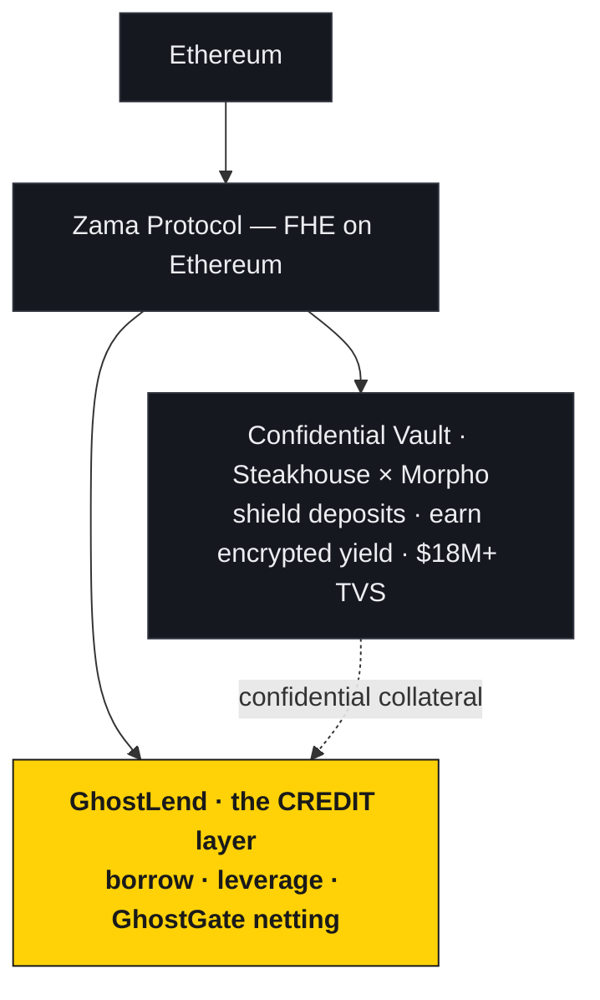
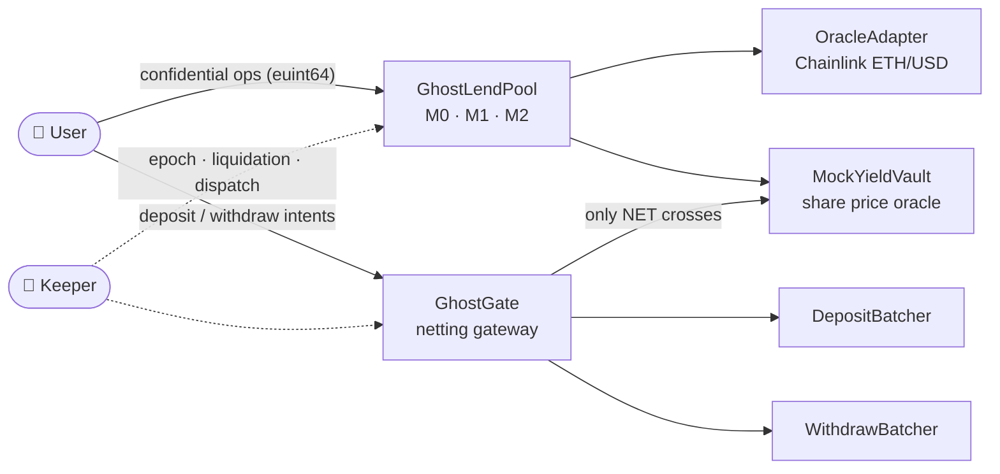
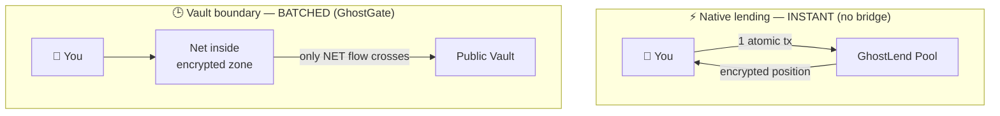
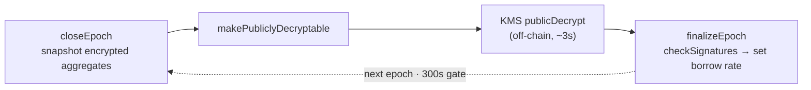
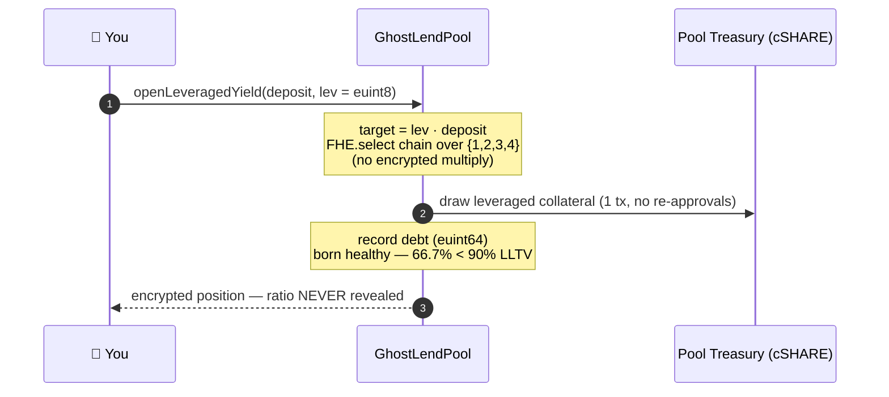
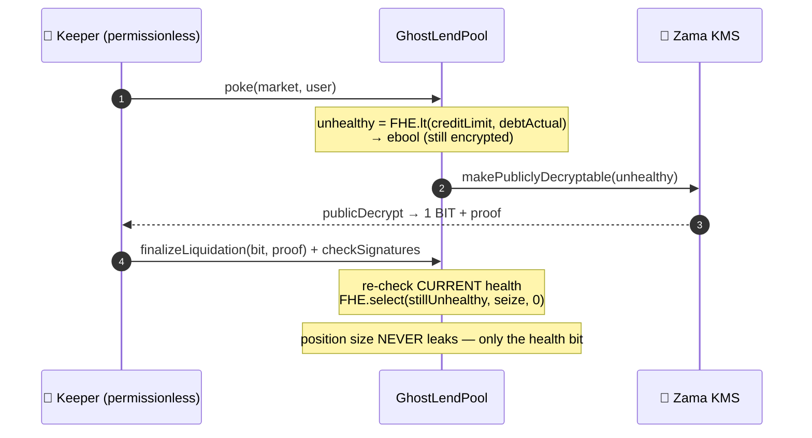
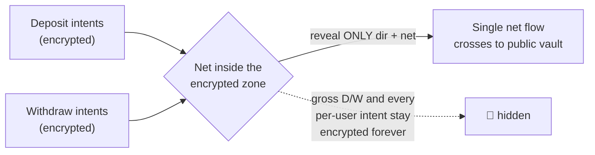

<div align="center">

# 👻 GhostLend

### Confidential lending & leverage on Ethereum — computed on ciphertext

**Borrow, leverage, and net your positions with the amounts, the debt, and even your _leverage ratio_ encrypted end-to-end.**
No plaintext position ever touches the chain. Built on Zama FHEVM. Live on Sepolia.

<br/>

[](https://docs.zama.ai/protocol)
[](https://sepolia.etherscan.io/)
[](https://soliditylang.org/)

[](https://ghostlend.vercel.app)
[](https://ghostlend-deck.vercel.app)
[](#-deployed-contracts-sepolia)
[-brightgreen?style=flat-square)](#-testing--coverage)
[](./LICENSE)

**[🌐 Live Demo](https://ghostlend.vercel.app) · [📊 Pitch Deck](https://ghostlend-deck.vercel.app) · [📜 Contracts](#-deployed-contracts-sepolia) · [🧠 How it works](#-under-the-hood--computing-on-ciphertext)**

</div>

---

## 📖 Table of contents

- [Why GhostLend](#-why-ghostlend)
- [Architecture](#-architecture)
- [The three pillars](#-the-three-pillars)
- [Under the hood — computing on ciphertext](#-under-the-hood--computing-on-ciphertext)
- [Confidential leverage](#-confidential-leverage)
- [Liquidation that reveals one bit](#-liquidation-that-reveals-one-bit)
- [GhostGate netting](#-ghostgate-netting)
- [The hard parts — FHE-native engineering](#-the-hard-parts--fhe-native-engineering)
- [Deployed contracts (Sepolia)](#-deployed-contracts-sepolia)
- [Markets](#-markets)
- [Tech stack](#-tech-stack)
- [Local development](#-local-development)
- [Testing & coverage](#-testing--coverage)
- [What's hidden vs public](#-whats-hidden-vs-public)
- [Limitations & roadmap](#-limitations--roadmap)

---

## 💡 Why GhostLend

Every lending position you open onchain is a public broadcast. Your **size**, your **debt**, your **liquidation price**, your **leverage** — all readable by anyone with an RPC endpoint. We treat that as normal; it isn't. It's an adversarial disadvantage baked into the rails, and tens of billions in lending/vesting TVL sit exposed line by line.

The **supply side** of confidential DeFi already exists — Zama's Protocol brings FHE to Ethereum, and the confidential vault from **Steakhouse × Morpho** lets you shield deposits and earn encrypted yield ($18M+ TVS live on mainnet). But there was a hole: you could shield your yield… then had to go **completely naked** to borrow against it.

> **GhostLend is the missing half — the credit layer.** Same protocol, same open-source ERC-7984 primitives. We add borrow, leverage, and netting — all confidential.

---

## 🏛 Architecture

### The stack — where GhostLend sits



### System map



### Two speeds — batch only at the public boundary



*Native lending needs no bridge, so it's instant. We batch **only** where confidential value crosses to public — the same design as Zama's own vault (60s window on testnet, ~12h on mainnet).*

### Epoch rate machine — async reveals, handled

Rates lag one epoch **by design**: utilization is only ever revealed as a *public aggregate*, once per epoch — individual positions never are.



---

## 🔱 The three pillars

| Pillar | What it does | Why it's special |
|---|---|---|
| **1 · Confidential lending** | Isolated markets (cWETH ↔ cUSDC) with encrypted supplied / collateral / debt | Instant, atomic, end-to-end encrypted — no batches |
| **2 · Vault-collateralized leverage** | Loop your Earn position up to **4×** in one tx against `csteakcUSDC` | The **leverage ratio itself is encrypted** (`euint8`); swap-free |
| **3 · Zero-leak cross-asset borrow** | Deposit confidential dollars → borrow confidential ETH via Market 1 composition | **No DEX, no public swap leg** — every step an encrypted pool op |

---

## 🧠 Under the hood — computing on ciphertext

This is what makes GhostLend more than a wrapper. Your balances are **`euint64`** — encrypted 64-bit integers in contract storage. When you borrow, the pool **never decrypts**. It computes on the encrypted state:

- **Adds** your encrypted collateral and clamps the borrow to an encrypted credit limit — no amount revealed.
- Checks health with an **encrypted comparison** (`FHE.lt`) returning an `ebool`, not a number.
- Applies the outcome with **branchless selection** (`FHE.select`) — never revealing *which* branch was taken.

> Transactions **never revert on your balance**. A failed borrow is silently clamped to your encrypted maximum, so even the *revert reason* can't be used to binary-search your position. Leakage is treated as the enemy — down to the error path.

---

## 🚀 Confidential leverage



**A real, on-chain worked example:**

| Metric | Value |
|---|---|
| Position from 10k cUSDC @ 3× | **30,000** |
| Debt / collateral (born healthy vs 90% LLTV) | **66.7%** |
| Net carry = `8% vault × 3 − 3.15% borrow × 2` | **+17.7%** |

Because Market 2 is **same-asset** (a confidential dollar vault-share against confidential dollars) there's **no swap and no public leg** — the loop never touches a DEX. Same-asset ⇒ no cross-asset price risk ⇒ the aggressive **90% LLTV**.

> On a transparent lender, everyone sees your leverage and hunts your liquidation. Here, the position, the debt, and the ratio are all ciphertext.

---

## ⚖️ Liquidation that reveals one bit



Health is evaluated on ciphertext; the **only** value ever decrypted is a single healthy/unhealthy boolean, threshold-decrypted by the KMS and verified onchain. A borrower who cured between `poke` and `finalize` is seized **zero** — branchlessly.

---

## 🌫 GhostGate netting



Deposits net against withdrawals inside the confidential zone; only **two values** ever cross — the net **direction** and net **amount**. Never who deposited, on which side, or how much. Illustratively, ~**80% less on-chain-visible volume**. This is Zama's own published **v2** direction: internal netting toward a single confidential gateway.

---

## 🔬 The hard parts — FHE-native engineering

The genuinely difficult part isn't wrapping a token — it's the pile of FHE constraints you have to design around.

| # | The constraint (FHE reality) | How GhostLend solves it |
|---|---|---|
| ① | **No ciphertext ÷ ciphertext** — you can only multiply by a *plaintext* scalar | Credit/rate math folded into **plaintext coefficients** (`_mulDivScalar`); GhostGate uses **pin-only** settlement — we *refused* to reveal one side's total (it would leak both aggregates) |
| ② | **A null handle `bytes32(0)` bricks the KMS** — it rejects it and freezes the epoch machine | Constructor baselines every aggregate to a real, trivially-decryptable `FHE.asEuint64(0)` + an activity gate on `closeEpoch`. *Found by self-audit, regression-tested.* |
| ③ | **You can't branch on a ciphertext** — `if (encrypted)` doesn't exist | Every conditional is `FHE.select`; leverage `target` is a **select-chain** over `euint8 ∈ {1,2,3,4}`; seize is gated on a re-derived health bit |
| ④ | **Reveals are asynchronous** (`makePubliclyDecryptable` → KMS `publicDecrypt` → finalize) | **Two-phase state machines** for epochs & liquidation, with replay guards + **self-healing** recovery from event logs; finalize stays under budget (**~2.78M HCU** < 5M ceiling) |
| ⑤ | **ACL hygiene is load-bearing** — wrong ACL ⇒ next op reverts or KMS won't decrypt | Every stored handle `allowThis` + `allow(user)`; outgoing transfers `allowTransient`; finalizers rebuild handles from storage under replay guards |

> None of these are in the "wrap an ERC-20" starter. They're the difference between a demo and a protocol.

---

## 📜 Deployed contracts (Sepolia)

> **Network:** Ethereum Sepolia (chainId `11155111`) · **All 7 core contracts Etherscan-verified** ✅

### Core protocol

| Contract | Address | Purpose |
|---|---|---|
| **GhostLendPool** | [`0x1E7Bc1…860b7`](https://sepolia.etherscan.io/address/0x1E7Bc12dD59600Ec5A801942e84B26c5ffe860b7) | 3 isolated markets (M0/M1/M2) |
| **OracleAdapter** | [`0x088362…c8495`](https://sepolia.etherscan.io/address/0x0883620ac3cbfe3ff28efb52Ee2998418AAc8495) | Chainlink ETH/USD wrapper, 2h staleness guard |
| **GhostGate** | [`0xb3D9A7…3cb95`](https://sepolia.etherscan.io/address/0xb3D9A7c8c8F0E721f9e69bb3eC08a0CB6a03cb95) | Netting gateway (dir + net only) |

### Market 2 vault stack

| Contract | Address | Purpose |
|---|---|---|
| **MockYieldVault** (gYVS) | [`0xfaC681…3838`](https://sepolia.etherscan.io/address/0xfaC681ccB925863fa336F89aa81c272b97593838) | ERC-4626 share-price oracle |
| **csteakcUSDC** | [`0x324A43…f8d8`](https://sepolia.etherscan.io/address/0x324A43A9269eB59f23713314df977272c2B8f8d8) | Confidential vault-share wrapper (ERC-7984) |
| **DepositBatcher** | [`0xc0C680…9FA43`](https://sepolia.etherscan.io/address/0xc0C68055A20849ea3892E2343A8320A8A8E9FA43) | cUSDC → vault → cSHARE |
| **WithdrawBatcher** | [`0x97576E…1112`](https://sepolia.etherscan.io/address/0x97576Eb9b73B255fB1D813BA69D17E1E57941112) | cSHARE → vault → cUSDC |

### Confidential tokens (ERC-7984)

| Token | Wrapper | Underlying |
|---|---|---|
| **cUSDC** (6 dec) | [`0x7c5BF4…3639`](https://sepolia.etherscan.io/address/0x7c5BF43B851c1dff1a4feE8dB225b87f2C223639) | USDC `0x9b5Cd1…DFfF` |
| **cWETH** (6 dec) | [`0x462086…3158`](https://sepolia.etherscan.io/address/0x46208622DA27d91db4f0393733C8BA082ed83158) | WETH `0xff5473…5f3F` |

---

## 🎯 Markets

| ID | Collateral → Debt | LLTV | Pricing |
|---|---|---|---|
| **M0** | cWETH → cUSDC | 80% | Chainlink ETH/USD |
| **M1** | cUSDC → cWETH | 80% | Chainlink ETH/USD |
| **M2** | csteakcUSDC → cUSDC | **90%** | Vault share price (swap-free leverage) |

---

## 🛠 Tech stack

| Layer | Technology |
|---|---|
| **FHE** | [Zama FHEVM](https://docs.zama.ai/protocol) · `@fhevm/solidity` 0.11.1 · `@zama-fhe/sdk` + `react-sdk` 3.2.0 |
| **Confidential tokens** | OpenZeppelin confidential-contracts 0.5.1 (ERC-7984) |
| **Oracle** | Chainlink ETH/USD |
| **Contracts** | Solidity 0.8.27 · Hardhat · viaIR · optimizer 800 |
| **Frontend** | Next.js · wagmi / viem · `@zama-fhe/react-sdk` · deployed on Vercel |
| **Keeper** | Node/Hardhat bot — epoch finalize · liquidation · GhostGate dispatch |

---

## 💻 Local development

```bash
# 1 · install
npm install

# 2 · run the mock-FHEVM test suite
npm test

# 3 · coverage
npx hardhat coverage

# 4 · deploy (needs an ETHERSCAN_API_KEY + funded deployer key in hardhat vars)
npx hardhat run scripts/deploy-all.ts --network sepolia

# 5 · run the keeper (epoch + liquidation + GhostGate, self-healing loop)
KEEPER_LOOP=1 npx hardhat run scripts/keeper.ts --network sepolia

# frontend
cd frontend && npm install && npm run dev
```

---

## ✅ Testing & coverage

- **Mock-FHEVM suites green** · **36 tests** including targeted audit-regression tests
- **91% line coverage** (97% on the core `GhostLendPool`)
- Liquidation finalize measured at **~2.78M HCU** (under the 5M homomorphic-complexity ceiling)
- FHE **ACL hygiene** verified — every stored handle `allowThis` + `allow(user)`, outgoing transfers `allowTransient`, finalizers rebuild handles under replay guards + `checkSignatures`
- Every audit finding (H-1 epoch-brick, H-2 liquidation over-seize, M-1 cash accounting) **fixed, redeployed, and regression-tested**

---

## 🕶 What's hidden vs public

| 🔒 Encrypted (`euint64`, per user) | 🌐 Public |
|---|---|
| Supplied principal, collateral, debt | Interest indexes, rates, utilization *(per epoch)* |
| Per-op error flag | Prices, LLTV, timestamps |
| **Leverage ratio** (`euint8`) | Participant addresses *(ERC-7984 exposes from/to; amounts stay encrypted)* |
| GhostGate gross D/W + per-user intents | Liquidation reveals **one bit** (healthy/unhealthy) |

> We **state the boundary instead of hiding it.** Addresses and timing are public by Ethereum's nature; what matters — amounts, positions, leverage, health — is ciphertext. Aggregate utilization is revealed per epoch purely for solvency, exactly the trade-off Zama's own vault makes.

---

## 🧭 Limitations & roadmap

Honest by design — a Developer-Program checkpoint, not a finished mainnet protocol:

- **Rates are epoch-lagged & keeper-dependent** — utilization is the last *revealed* value; rates freeze if the keeper is down. *Roadmap: keeperless/incentivised epoch closing.*
- **IRM quantization** — the per-second rate is 1e9 fixed-point and truncates at low utilization (nominal 4.5% → ~3.15% effective borrow; supply rate rounds to 0 at these utils). *Roadmap: higher-precision index.*
- **Vault yield is simulated** — `MockYieldVault` is the only mock (honestly labeled in-contract & UI as a Steakhouse-Prime replica); yield is a keeper drip. *Roadmap: real confidential ERC-4626 strategy.*
- **Oracle** — Chainlink ETH/USD only; USDC assumed = $1; vault share-price is a plaintext oracle.
- **Batch anonymity is N−1** within a `minBatchAge` window; participation/timing are public.
- **Single off-chain keeper** with a hot key drives epoch/liquidation/gate — not yet decentralized.

Full design-of-record: [`docs/ARCHITECTURE.md`](./docs/ARCHITECTURE.md) · [`docs/ADDENDUM.md`](./docs/ADDENDUM.md) · [`docs/BATCHER-NOTES.md`](./docs/BATCHER-NOTES.md) · [`deployments/ADDRESSES.md`](./deployments/ADDRESSES.md)

---

<div align="center">

### Built for the **Zama Developer Program · Season 3**

**[🌐 ghostlend.vercel.app](https://ghostlend.vercel.app) · [📊 Deck](https://ghostlend-deck.vercel.app) · [🔐 Zama Protocol](https://docs.zama.ai/protocol)**

*GhostLend is the native half of confidential DeFi — borrow, leverage, and net, with everything encrypted.*

</div>
